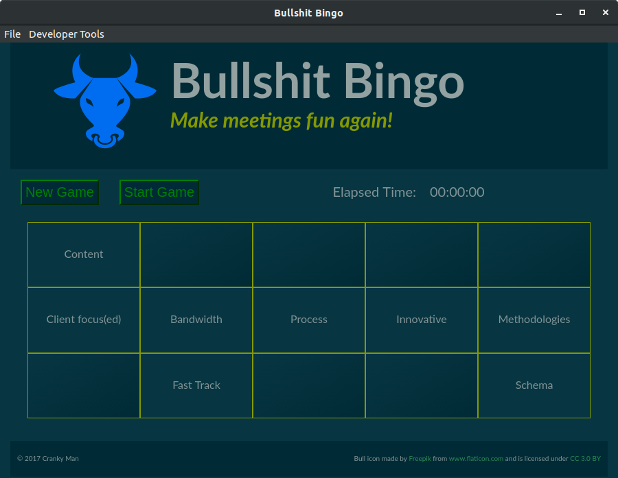

# Table of Contents

1.  [Bullshit Bingo - Electron Edition](#org5a7e758)
    1.  [Purpose](#org2aa944a)
    2.  [Approach](#org18814f9)
2.  [Repository Layout](#orgeed5b9c)
3.  [Screenshots](#org976837f)

# Bullshit Bingo - Electron Edition

This is a very simple implementation of the game "Bullshit Bingo" or as it may
be called by those who are offended by words "Buzzword Bingo". It is just like
normal Bingo, but instead of numbers, the **card** consists of words which are
often heard when listening to fast speaking, slick sales types or pointy haired
bosses who are out of their depth, but want to sound knowledgeable.

Watch the below video to get a better idea about Bullshit Bingo!

[\)](<http://www.youtube.com/watch?v=Dnkow4y1cyw>)

At the end of the day, it is all just a bit of fun. Can't deal or find it
offensive, move on. Life is too short to take this crap seriously.

## Purpose

The real purpose for this repo is to have something to experiment with. When
evaluating new technology, languages, frameworks, etc, you need something to
base your evaluation on. It seems the current practice is to use a **todo list**
or some form of **shoping list** application to do this. Unfortunately, that
crosses my bordum threshold. Bullshit Bingo to the rescue!

## Approach

In this repo, I plan to implement basic and functional version of the game using
different frameworks, languages, technologies etc. Essentially, it is a
playground for my learning process. I publish it in case others find it useful
or to get feedback from those more informed than me regarding mistakes,
alternative approaches or ways to improve things.

I plan to use [Electron](https://electronjs.org/)  for many of the implementations because I like the idea
underlying Electron. I also think it fits with the concept of the game
i.e. handy to be able to run a local app which deson't require network access
etc. It also avoids the overhead of running a web server. However, some of the
things I plan to do will require a web server because the technology is too
tightly coupled with the clinet/server architecture or because the overhead
associated with getting things to work in Electron is too high.

As far as possible, I will try to keep things minimal. I want to focus on a
specific technology, framework or language in each version and not get caught up
in side issues, such as build tools, editor integration, libraries or
optimisation. 

My philosophy is maintenance over cleverness. I don't optimise code until I know
I have a performance issue and I will try to strike the right balance between
code brevity and clarity. This can be challenging when using languages your not
familiar with, so expect lots of refactoring. 

Testing and documentation are probably my two weakest areas of discipline. At an
intellectual level, I understand the huge benefits of testing and using
different types of testing (unit, integration, regression etc). However, when
I'm in the 'flow', it takes considerable effort to be disciplined, to document
and test as you go. While I have always used testing extensively, I have been
less formal on how this is done. I will attempt to reverse this bit of laziness
and use different test frameworks and formal documentation tools when possible. 

Very unlikely there will be much *real* documentation. However, I will keep
notes and other information which documents the process and my experiences in
the `docs` directory for each version.

# Repository Layout

There will be a tree within the top level of the repository for each language,
technology or framework. A smarter way to do this would probably be to have
separate repositories for each of the implementations and make this repository a
parent repository, but &#x2026;..

# Screenshots

People like to see screenshots&#x2026;.

State as of 2nd January, 2018. Basic functionality in place. You can generate a new **game card** and can toggle the **seen** status of words by clicking on them with the mouse. 

\

